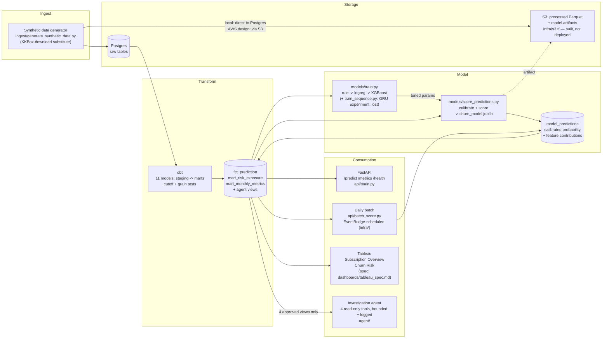

# Architecture

Step 8.4. One diagram, source to consumption — most of a reviewer's time
goes here and in the demo recording, not in cloning the repo.

## Reading this diagram against what's actually running vs. built-not-deployed

| Path | Status |
|---|---|
| Generator -> Postgres -> dbt -> marts | Running locally (`docker compose up -d`, `dbt build`) |
| marts -> `models/train.py` / `score_predictions.py` -> `model_predictions` | Running locally |
| marts -> FastAPI (`/predict`, `/metrics`, `/health`) | Running locally, verified through `docker compose up -d` including the containerized API |
| Daily batch (`api/batch_score.py`) | Running locally (`python3 -m api.batch_score`); **not yet triggered by EventBridge** — that Terraform exists (`infra/eventbridge.tf`) but is unapplied |
| S3 (artifacts) | **Built, not deployed** (`infra/s3.tf`) — the Dockerfile currently `COPY`s the artifact from the local build context instead |
| ECR / ECS Fargate | **Built, not deployed** (`infra/ecr.tf`, `infra/ecs.tf`) |
| Tableau dashboards | **Spec + SQL only** (`dashboards/tableau_spec.md`) — Tableau is a GUI app outside what this repo drives; the dashboards themselves are the user's to build from the spec |
| Investigation agent | Tools built and tested against the real database (`tests/test_agent_tools.py`); the LLM orchestration loop (`agent/orchestrator.py`) exists and is wired to the Anthropic API — live-run status depends on whether an API key with credits was available this session (see `CLAUDE.md`'s Week 8 entry) |

The reason for drawing the full intended architecture rather than only
what's live: `infra/README.md`'s deploy order turns every dotted/unapplied
piece above into a running one without changing this diagram — the
diagram is the target, not a snapshot that goes stale the moment AWS
deployment happens.
