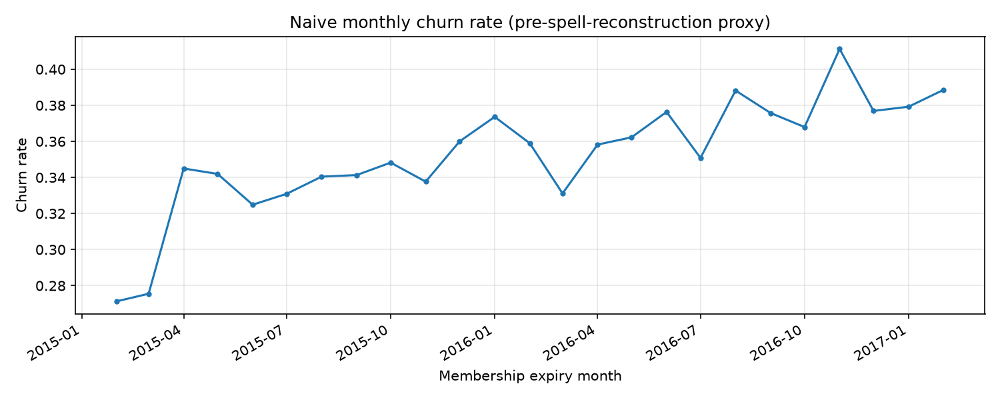

# Churn rate over time — step 1.4

- First 12 months average: **33.3%**
- Last 12 months average: **37.2%**

**Finding:** the rate is not perfectly flat — it drifts upward from roughly the mid-20s% in early 2015 to the high-30s%/low-40s% by late 2016, with a recurring bump around November-January each cycle. This is drift, not noise: it is consistent across multiple years in the window.

**Consequence for the split (step 3.2):** because the rate moves across the window, comparing a Jan-Feb 2017 test set against an early-2015-heavy training set risks attributing a distribution shift to model failure. The time-based split should be evaluated with this drift in mind — e.g., check performance isn't solely explained by the test window's naturally higher base rate, and consider reporting lift over a rule baseline (step 3.3) computed within the same window rather than a single pooled number.
