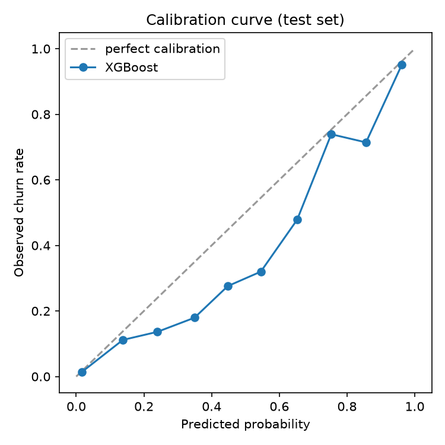

# Model results — steps 3.2-3.4

Train: 33,820 rows (cutoff <= 2016-11-30), churn rate 8.1%
Val: 1,552 rows (2016-12), churn rate 7.4%
Test: 2,842 rows (2017-01/02), churn rate 6.1%

## Results table (test set, reported once)

| model | PR-AUC | ROC-AUC | precision@5% | recall@5% | Brier |
|---|---|---|---|---|---|
| rule baseline (full rule, not top-5%) | - | - | 0.111* | 0.741* | - |
| logistic_regression | 0.5307 | 0.8944 | 0.570 | 0.466 | 0.0392 |
| xgboost (optuna-tuned) | 0.6510 | 0.9321 | 0.676 | 0.552 | 0.0350 |

*Rule baseline is a hard binary flag (`is_auto_renew=0`), not a ranked score — its row reports precision/recall of the rule itself, not a top-5% cut. `rule@5%` below is the comparable ranking-based number used for lift.

- Rule baseline @ top-5% by score: precision=0.127, recall=0.103
- **Lift over rule baseline (recall@5%): logistic regression 4.50x, XGBoost 5.33x**

## Calibration



XGBoost Brier score: 0.0350. See plot for the full curve — points near the diagonal indicate predicted probabilities can be trusted as probabilities, which matters directly for the revenue exposure calculation (step 6.1) that multiplies probability by expected renewal value.

## Segment breakdown (XGBoost, test set)

| segment_type | segment | n | churn_rate | PR-AUC |
|---|---|---|---|---|
| plan_days | 7 | 122 | 6.6% | 0.386 |
| plan_days | 30 | 1,860 | 5.5% | 0.642 |
| plan_days | 90 | 465 | 7.7% | 0.746 |
| plan_days | 180 | 231 | 7.4% | 0.684 |
| plan_days | 410 | 164 | 6.7% | 0.590 |
| tenure_band | 91-365d | 930 | 6.2% | 0.591 |
| tenure_band | 365d+ | 1,912 | 6.1% | 0.680 |

## Best XGBoost hyperparameters (Optuna, 30 trials, optimized against validation PR-AUC)

```json
{
  "max_depth": 8,
  "learning_rate": 0.057058425054635334,
  "n_estimators": 182,
  "reg_alpha": 0.5454960724088312,
  "reg_lambda": 0.2809975286430791,
  "subsample": 0.9009763001276623,
  "colsample_bytree": 0.6412999567857309,
  "scale_pos_weight": 2.3903679899676167,
  "random_state": 42,
  "eval_metric": "aucpr"
}
```
